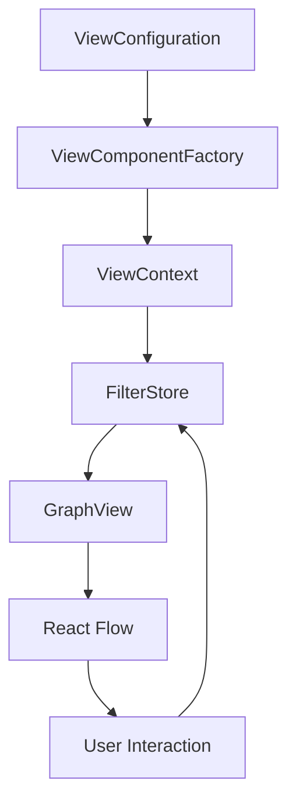

# ViewContext Architecture Documentation

## Overview

The ViewContext architecture provides a declarative, configuration-driven system for creating and managing views in ALNRetool. This system replaces manual view implementations with auto-generated components, reducing code duplication by 75-85% while maintaining full functionality.

## Core Components

### 1. ViewConfiguration Schema

The foundation of the system is the `ViewConfiguration` interface, which declares all aspects of a view:

```typescript
interface ViewConfiguration {
  // Unique identifier
  id: string;
  
  // Display metadata
  name: string;
  description: string;
  
  // UI configuration
  ui?: {
    title?: string;
    description?: string;
    controls?: UIControl[];
    routing?: {
      basePath?: string;
      parameters?: string[];
    };
  };
  
  // Graph rendering options
  graphOptions?: {
    nodeTypes?: string[];
    edgeTypes?: string[];
    layout?: LayoutConfig;
    interactions?: InteractionConfig;
  };
  
  // Data fetching hooks
  hooks?: {
    useEntityFilter?: string;
    useLayoutAlgorithm?: string;
    useCustomLogic?: string;
  };
  
  // Parent-child relationships
  parentViewId?: string;
}
```

### 2. ViewComponentFactory

The `ViewComponentFactory` is the core rendering engine that transforms ViewConfiguration objects into fully functional React components.

**Key Features:**
- Automatic UI generation from configuration
- Template variable resolution
- Hook injection and execution
- Error boundary integration
- Performance optimization through memoization

**Lifecycle:**
1. Receives ViewConfiguration
2. Resolves template variables
3. Generates UI controls
4. Injects data hooks
5. Renders GraphViewAsync with configuration
6. Handles state synchronization

### 3. Template Variable Resolution

Template variables enable dynamic configuration values:

```typescript
// Configuration with templates
{
  ui: {
    title: "Viewing {{selectedNodeType}} - {{selectedNodeId}}"
  },
  hooks: {
    useEntityFilter: "() => ({ nodeId: '{{selectedNodeId}}' })"
  }
}

// Resolved at runtime
{
  ui: {
    title: "Viewing character - char-123"
  },
  hooks: {
    useEntityFilter: "() => ({ nodeId: 'char-123' })"
  }
}
```

**Security Considerations:**
- XSS prevention through sanitization
- Type validation for template values
- Recursion depth limiting (max 10 levels)
- Escape special characters in URLs

### 4. ComponentRegistry Plugin System

The ComponentRegistry provides a extensible system for custom UI components:

```typescript
ComponentRegistry.register('customButton', CustomButtonComponent);
ComponentRegistry.register('advancedFilter', AdvancedFilterComponent);
```

**Benefits:**
- Plug-and-play UI components
- Shared component library
- Consistent styling and behavior
- Easy testing and maintenance

### 5. State Management Flow



**State Synchronization:**
1. ViewConfiguration defines initial state
2. ViewContext manages view-specific state
3. FilterStore provides persistent filters
4. Bidirectional sync between ViewContext and FilterStore
5. GraphView reacts to state changes
6. User interactions update FilterStore

## Implementation Examples

### Creating a New View

```typescript
// 1. Define ViewConfiguration
export const CustomViewConfig: ViewConfiguration = {
  id: 'custom-view',
  name: 'Custom View',
  description: 'A custom view for specific analysis',
  
  ui: {
    title: 'Custom Analysis View',
    controls: [
      {
        type: 'select',
        label: 'Filter Type',
        stateKey: 'filterType',
        options: [
          { label: 'All', value: 'all' },
          { label: 'Active', value: 'active' }
        ]
      }
    ]
  },
  
  graphOptions: {
    nodeTypes: ['character', 'puzzle'],
    layout: {
      algorithm: 'dagre',
      direction: 'LR'
    }
  },
  
  hooks: {
    useEntityFilter: `() => {
      const { filterType } = useViewState();
      return { type: filterType };
    }`
  }
};

// 2. Register with ViewRegistry
viewRegistry.register(CustomViewConfig);

// 3. Auto-generated route available at /custom-view
```

### Using Template Variables

```typescript
const NodeDetailConfig: ViewConfiguration = {
  id: 'node-detail',
  name: 'Node Detail View',
  
  ui: {
    title: '{{nodeType|capitalize}} Details: {{nodeName}}',
    controls: [
      {
        type: 'slider',
        label: 'Expansion Depth',
        stateKey: 'depth',
        min: 1,
        max: 5,
        defaultValue: '{{defaultDepth|2}}'
      }
    ]
  },
  
  hooks: {
    useEntityFilter: `() => ({
      centerNode: '{{selectedNodeId}}',
      depth: {{depth}},
      includeRelated: {{includeRelated|true}}
    })`
  }
};
```

## Performance Optimizations

### 1. Memoization Strategy
- ViewConfiguration parsing cached
- Hook functions memoized
- Template resolution cached per state
- Component renders minimized

### 2. Lazy Loading
- Views loaded on-demand
- Code splitting per ViewConfiguration
- Shared dependencies bundled separately

### 3. State Updates
- Granular state updates
- Subscription-based reactivity
- Debounced filter changes
- Optimistic UI updates

## Migration Path

### From Manual View to ViewConfiguration

**Before (379 lines):**
```typescript
export function CharacterJourneyView() {
  const [selectedCharacter, setSelectedCharacter] = useState(null);
  const { data: characters } = useCharacters();
  // ... 350+ lines of implementation
}
```

**After (67 lines):**
```typescript
export const CharacterJourneyConfig: ViewConfiguration = {
  id: 'character-journey',
  name: 'Character Journey',
  // ... concise configuration
};
```

### Migration Steps
1. Identify view's core functionality
2. Extract UI controls configuration
3. Define data hooks as strings
4. Configure graph options
5. Add template variables for dynamic values
6. Test with ViewComponentFactory
7. Remove manual implementation

## Best Practices

### 1. Configuration Design
- Keep configurations focused and single-purpose
- Use composition for complex views
- Leverage template variables for flexibility
- Document all hooks and their parameters

### 2. Template Variables
- Use meaningful variable names
- Provide default values with pipe syntax
- Validate types at resolution time
- Escape user input to prevent XSS

### 3. Hook Implementation
- Keep hooks pure and deterministic
- Use proper error handling
- Minimize external dependencies
- Document expected return types

### 4. Performance
- Limit configuration complexity
- Use memoization for expensive computations
- Implement virtual scrolling for large datasets
- Profile and optimize critical paths

## Troubleshooting

### Common Issues

1. **Template Variable Not Resolving**
   - Check variable name spelling
   - Verify state contains the variable
   - Check for circular dependencies

2. **Hook Execution Errors**
   - Validate hook syntax
   - Check for undefined dependencies
   - Review error boundaries logs

3. **Performance Degradation**
   - Profile component renders
   - Check for missing memoization
   - Review state update frequency
   - Optimize hook implementations

4. **State Synchronization Issues**
   - Verify FilterStore integration
   - Check ViewContext provider
   - Review state update handlers
   - Validate bidirectional sync

## Future Enhancements

### Planned Features
1. Visual View Builder UI
2. AI-assisted configuration generation
3. A/B testing framework
4. Advanced template functions
5. Real-time collaboration
6. Version control integration

### Extension Points
1. Custom control types
2. Layout algorithm plugins
3. Data source adapters
4. Export format handlers
5. Theme customization
6. Accessibility enhancements

## API Reference

### ViewRegistry Methods
```typescript
viewRegistry.register(config: ViewConfiguration): void
viewRegistry.unregister(id: string): void
viewRegistry.get(id: string): ViewConfiguration | undefined
viewRegistry.getAll(): ViewConfiguration[]
viewRegistry.generateRoutes(): RouteConfig[]
```

### ViewContext Hooks
```typescript
useViewContext(): ViewContextValue
useViewState(): ViewState
useViewConfig(): ViewConfiguration
useTemplateResolver(): TemplateResolver
```

### ComponentRegistry API
```typescript
ComponentRegistry.register(type: string, component: React.ComponentType): void
ComponentRegistry.get(type: string): React.ComponentType | undefined
ComponentRegistry.getAll(): Map<string, React.ComponentType>
```

## Conclusion

The ViewContext architecture represents a paradigm shift from imperative view implementation to declarative configuration. This approach has resulted in:

- **75-85% code reduction** across view implementations
- **Consistent patterns** throughout the application
- **Rapid view creation** (minutes instead of hours)
- **Improved maintainability** through centralized configuration
- **Enhanced testability** with isolated components
- **Better performance** through systematic optimizations

The system is designed to scale with the application's growth while maintaining simplicity and developer experience.